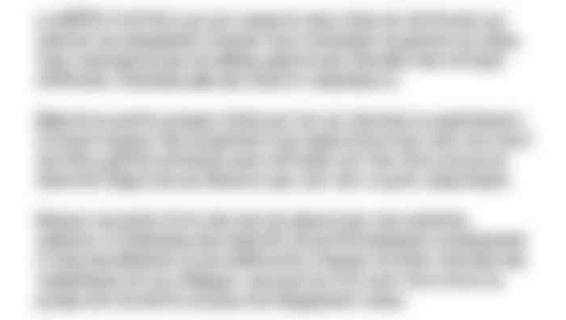
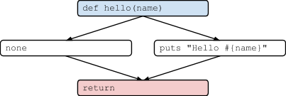

## Code Quality, meh?!

Christophe Philemotte, Belighted, 9 May 2013

---

### About me

* Developer ([@toch on GitHub](https://github.com/toch), [@_toch on Twitter](https://twitter.com/_toch))
* Author on [blog.8thcolor.com](http://blog.8thcolor.com)
* CoFounder of PullReview [https://pullreview.com](https://pullreview.com)

---


---

> I hope to see Ruby help every programmer in the world to be productive, and to
> enjoy programming, and to be happy. That is the primary purpose of Ruby
> language.
> **Matz, 2008**

---

> Code is like farts. It stinks if it isn't yours.

---


---



---


---


---


---

### For Developer

* productivity / time
* confidence

---

### For Company

* money
* confidence

---

### 2 Aspects

* Functional
* Structural

---

### Functional

How it complies to the:

* user stories
* specs
* functionalities
* requirements

---

### Structural

* Reliability
* Efficiency
* Security
* Maintainability
* Size

---

### How to check them?

---


---

* Tests
* _
* _

---

* Tests
* Code Review
* _

---

* Tests
* Code Review
* Static Analysis

---

### What can we measure with Static Analysis?

---

* Reliability
* (Efficiency)
* Security
* Maintainability
* Size

---

### How can we measure?

---

* Complexity
* Duplication
* Code Style
* Test infection
* Suspicious constructs / Flaws
* Code Smells
* Best Practices
* Security

---

### Complexity

---

>  How complex it is to understand and modify your code.

---

It's correlated to the number of bugs.

---

```
def hello_world
 puts "Hello world"
end
```


---

```
def hello(name)
 if name
    puts "Hello #{name}"
 end
end
```



---

```
def hello(name)
 return unless name
 puts "Hello #{name}"
end
```


---

### Duplication

---


---

It's correlated to the number of bugs.

---

### Code Style

---


---

### Test infection

---


---

To find untested code

---

### Suspicious constructs / Flaws

### Code Smells

### Best Practices

---


---

### Security

---


---

# Thanks! Questions?
